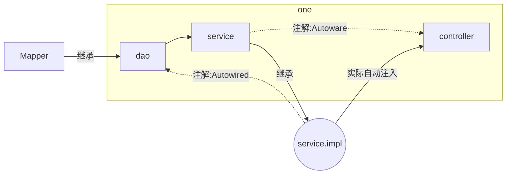

# 这是一个基于springboot的畅购商城学习项目
> [视频链接](https://www.bilibili.com/video/BV1N7411k7bP)

## 所使用的相关包名
- changgou-common：公共模块
- changgou-eureka：eureka模块
- changgou-gateway：网关模块
- changgou-service
- changgou-service-api
- changgou-web

## 自我理解
### `changgou-service`/`changgou-service-api` 模块
`changgou-service-api` -> `changgou-service-goods-api`: 包含有数据库的pojo类，和数据库数据结构相关
`changgou-service` -> `changgou-service-goods`: 操作数据库
> 同样的，这样个模块下类似命名的子模块都以此类推

### `dao`,`service`,`controller`的关系



`dao` -> `service` -> `controller`

---
## 工程结构


---
## FastDFS
>FastDFS是一个开源的`轻量级分布式文件系统`，它对文件进行管理，功能包括：`文件存储`、`文件同步`、`文件访问（文件上传、文件下载)`等，解决了`大容量存储`和`负载均衡`的问题。特别适合以文件为载体的在线服务，如相册网站、视频网站等等。  
>
>FastDFS为互联网呈身定制，充分考虑了冗余备份、负载均衡、线性扩容等机制，并注重高可用、高性能等指标，使用FastDFS很容易搭建一套高性能的文件服务器集群提供文件上传、下载等服务。  

>FastDFS架构包括`Tracker server`和`Storage server`。客户端请求Tracker server进行文件上传、下载，通过Tracker server调度最终由Storage server完成文件上传和下载。Tracker server作用是负载均衡和调度，通过Tracker server在文件上传时可以根据一些策略找到Storage server提供文件上传服务。可以将tracker称为追踪服务器或调度服务器。Storage server作用是文件存储，客户端上传的文件最终存储在Storage服务器上，Storageserver没有实现自己的文件系统而是利用操作系统的文件系统来管理文件。可以将storage称为存储服务器。


FastDFS启动：
```shell script
# 运行storage
docker run -d --name tracker --net=host morunchang/fastdfs sh tracker.sh

# 运行storage
docker run -d --name storage --net=host -e TRACKER_IP=<your tracker server address>:22122 -e GROUP_NAME=<group name> morunchang/fastdfs sh storage.sh
# -e 环境变量 
# 使用的网络模式是–net=host, 替换为你机器的Ip即可
# 是组名，即storage的组
# 如果想要增加新的storage服务器，再次运行该命令，注意更换 新组名
```
进入`storage`容器 修改nginx配置（`/data/nginx/conf/nginx.conf`）：
```
location /group1/M00 {
    proxy_next_upstream http_502 http_504 error timeout invalid_header;
    proxy_cache http-cache;
    proxy_cache_valid  200 304 12h;
    proxy_cache_key $uri$is_args$args;
    proxy_pass http://fdfs_group1;
    expires 30d;
 }
```
退出并重启`storage`容器

开启启动：
```shell script
[root@192 ~]# docker update --restart=always tracker
[root@192 ~]# docker update --restart=always storage
```
----
文件上传的真实路径：
`vi /etc/fdfs/storage` ->
```shell script
# store_path#, based 0, if store_path0 not exists, it's value is base_path
# the paths must be exist
store_path0=/data/fast_data
#store_path1=/home/yuqing/fastdfs2
```
> 即：`M00 -> /data/fast_data`

