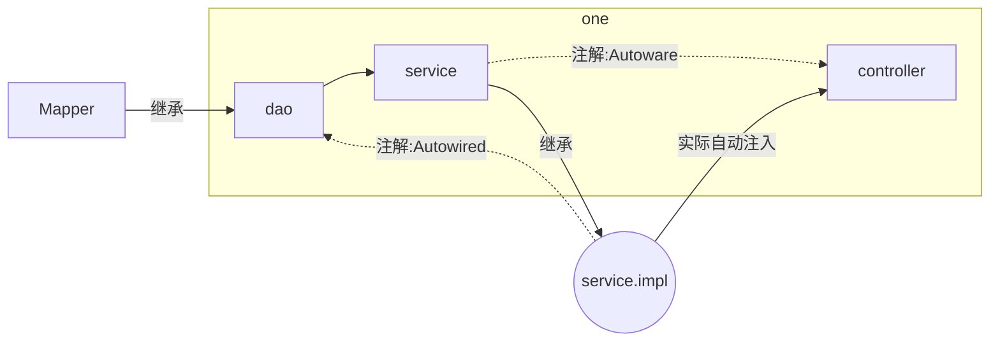

# 这是一个基于springboot的畅购商城学习项目
> [视频链接](https://www.bilibili.com/video/BV1N7411k7bP)

## 所使用的相关包名
- changgou-common：公共模块
- changgou-eureka：eureka模块
- changgou-gateway：网关模块
- changgou-service
- changgou-service-api
- changgou-web

## 自我理解
### `changgou-service`/`changgou-service-api` 模块
`changgou-service-api` -> `changgou-service-goods-api`: 包含有数据库的pojo类，和数据库数据结构相关
`changgou-service` -> `changgou-service-goods`: 操作数据库
> 同样的，这样个模块下类似命名的子模块都以此类推

### `dao`,`service`,`controller`的关系

`dao` -> `service` -> `controller`

---
## 工程结构
